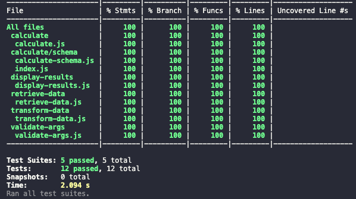

# Adylic

Adylic tech test - Senior Backend NodeJS Developer - Lee Gilmore

LinkedIn: _https://www.linkedin.com/in/lee-james-gilmore/_

Medium: _https://medium.com/@leejamesgilmore/enterprise-serverless-series-358be237b510_

Twitter: _https://twitter.com/LeeJamesGilmore_

Email: _lee.gilmore@gmail.com_

## Task Summary

The online feed:

http://www.ecb.europa.eu/stats/eurofxref/eurofxref-daily.xml

contains some up-to-date Euro exchange rates.
Write a small command line NodeJS script to convert currencies supported in
the feed.
The layout of the command must be as follows:

```javascript
node currencyConverter.js [value] [from currency] [to currency]
```

**Examples**:

- node currencyConverter.js 100.00 GBP EUR prints 119.97 at the time of
  writing
- node currencyConverter.js 200.50 CFH CAD prints 267.85 at the time of
  writing

The code must be:

- Easy to read and extended (_e.g. the currency exchange data should be easily
  replaceable with another source in the future_).
- Shipped with 100% unit test coverage (_Optional but desirable_)

## Getting started

To run the program please do the following

### Installation

To install the application please do the following steps:

1. Install node version 14.16.0 (_see the following link to installing via nvm: https://github.com/nvm-sh/nvm_)

2. Using your terminal run the following command to install the correct node version via nvm (_optional - if using nvm_):

```
nvm install v14.16.0
```

3. Run the following command to use the node version just installed (_optional - if using nvm_):

```
nvm use v14.16.0
```

4. In the root of the folder run the following command to install the application:

```
npm i
```

### Running the application

The following table shows the various commands which can be ran:

| Name              | Command                                                                     |                                  Description |
| ----------------- | --------------------------------------------------------------------------- | -------------------------------------------: |
| **Run app**       | node currencyConverter.js [__value__] [__from__ currency] [__to__ currency] |  _node currencyConverter.js 1000.45 GBP USD_ |
| **Test**          | npm run test                                                                |               _This will run the unit tests_ |
| **Test watch**    | npm run test:watch                                                          | _This will run the unit tests in watch mode_ |
| **Test coverage** | npm run test:coverage                                                       | _This will run the unit tests with coverage_ |

> **Note**: _The result of running the app will be the converted value._

## Discussion Points

### Design / Implementation

The solution has been designed so that:

1. Input parameters are tested up front (_inc ensuring to and from keys are upper case_)
2. the data feed can be switched out at a later date simply by changing the url in the config file. (_additional options can be passed through to axios too_)
3. the data will most probably come back in a different shape if the url changes, so it can be easily transposed using function _transformData(data)_ so the remainder of the program runs as usual.
4. The calculation function ensures that the transposed data (_regardless of where it comes from_) is in the correct shape using schema validation.
5. All errors are caught and user friendly, rather than unexpected errors being displayed to the end user.

### Linting/Code Standards

The solution has utilised esLint, prettier, lint-staged and husky to enure that on pre-commit the code styles are standardised across the repo, for example single quotes over double.

### Code coverage

The solution has 100% code coverage as shown in the picture below.



### Last thoughts

If I was to make this production ready I would do the following:

1. Look at creating the tool as a CLI so it can be installed and ran (_rather than directly through node_).
2. I would add --help feature if this was a CLI.
3. The current feed is only updated once a day so I would look at optional caching based on config.
4. I would be more stringint on the schema validation using regexes, checking over posting etc
5. I would write errors to an app log (this could be turned off via config).
